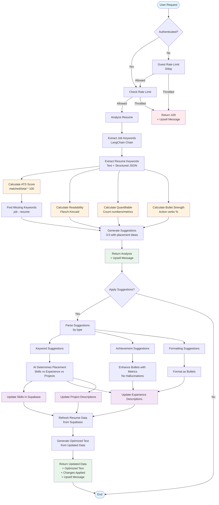

# AI Resume Analysis and Optimization Flow

This document describes the flow of AI-powered resume analysis and suggestion application.

## Mermaid Diagram



## Key Components

### 1. Rate Limiting
- **Guests**: 3 calls per day for analyze-resume and apply-suggestions
- **Authenticated Free Users**: Same limits (can be upgraded to Pro)
- **Pro Users**: Unlimited

### 2. Keyword Extraction (LangChain)
- Uses LangChain chain with OpenAI to extract unique keywords from job description
- Removes duplicates and stop words
- Falls back to regex-based extraction if LangChain unavailable

### 3. Resume Keyword Extraction
- Extracts from both:
  - Plain text resume
  - Structured JSON (skills, projects, experiences)
- Matches project technologies to job keywords

### 4. Scoring Formulas

#### ATS Score
```
ATS Score = (matched_keywords / total_job_keywords) * 100
```

#### Readability Score
- Uses Flesch-Kincaid Reading Ease (via textstat)
- Falls back to sentence length heuristic if textstat unavailable
- Normalized to 0-100 scale

#### Quantifiable Achievements
- Counts numbers, percentages, metrics in text
- Score based on count: 5+ = 90, 3+ = 75, 1+ = 60, 0 = 30

#### Bullet Strength
- Percentage of bullets starting with action verbs
- Action verbs: developed, implemented, created, managed, led, etc.

### 5. Suggestion Generation
- 3-5 suggestions with:
  - Type (keyword, achievement, formatting, content)
  - Text with placement ideas
  - Priority (high, medium, low)

### 6. Suggestion Application
- **For Authenticated Users**:
  - Updates Supabase directly (skills, experiences, projects)
  - Uses AI to determine best placement
  - Avoids hallucinations (only enhances existing content)
  - Returns updated structured data + optimized text

- **For Guest Users**:
  - Text-only mode (no Supabase updates)
  - Returns optimized text only

### 7. Anti-Hallucination Measures
- Only enhances existing descriptions
- Doesn't add fake achievements
- Uses AI conservatively with low temperature (0.3-0.5)
- Validates all updates against original data

### 8. Upsell Messages
- Added to all responses for non-Pro users
- Message: "Upgrade to Pro ($9/mo) for unlimited optimizations and job matching."

## API Endpoints

### POST /api/v1/ai/analyze-resume/
**Request:**
```json
{
  "resume_id": "uuid" (optional),
  "resume_text": "text" (optional),
  "job_desc": "text" (optional)
}
```

**Response:**
```json
{
  "ats_score": 75,
  "missing_keywords": ["aws", "kubernetes"],
  "suggestions": [
    {
      "type": "keyword",
      "text": "Add keywords: aws, kubernetes. Add to Skills section.",
      "priority": "high"
    }
  ],
  "readability_score": 85,
  "bullet_strength": 78,
  "quantifiable_achievements": 65,
  "keyword_score": 70,
  "formatting_score": 75,
  "detailed_analysis": {...},
  "pro_tip": "Upgrade to Pro ($9/mo) for unlimited optimizations and job matching."
}
```

### POST /api/v1/ai/apply-suggestions/
**Request (Authenticated):**
```json
{
  "resume_id": "uuid" (required),
  "suggestions": [...],
  "missing_keywords": ["aws"]
}
```

**Request (Guest):**
```json
{
  "resume_text": "text" (required),
  "suggestions": [...],
  "missing_keywords": ["aws"]
}
```

**Response:**
```json
{
  "resume_data": {...},  // Updated structured data (authenticated only)
  "optimized_text": "text",
  "changes_applied": [
    "Added 'AWS' to Skills section",
    "Enhanced experience 'Developer' with keywords: aws"
  ],
  "pro_tip": "Upgrade to Pro ($9/mo) for unlimited optimizations and job matching."
}
```


